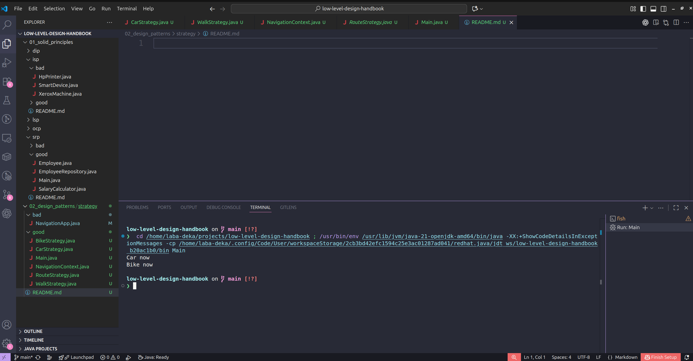

# Strategy Pattern

## 1. Definition
> "Define a family of algorithms, encapsulate each one, and make them interchangeable. Strategy lets the algorithm vary independently from clients that use it."

## 2. The Senior Translation
The Strategy Pattern is the "Kill Switch" for giant `if-else` or `switch` statements.
Instead of hardcoding logic inside a class, you pass the logic *into* the class as an object. This allows you to change behavior at runtime without changing the code of the class itself.

## 3. The Analogy: Google Maps
When you ask Google Maps for directions from Point A to Point B, you select a mode of transport:
* Car Strategy: Optimizes for traffic and speed.
* Bike Strategy: Optimizes for elevation and bike lanes.
* Walk Strategy: Optimizes for shortest distance and sidewalks.

Google Maps does not have one massive function called `calculateRoute(mode)`. It has a `RouteStrategy` interface. The app simply delegates the calculation to the selected strategy.

## 4. The "Bad" Way (Violation)
Logic is tightly coupled to the main class using conditional statements.

    public class NavigationApp {
        public void buildRoute(String type) {
            if (type.equals("car")) {
                // 100 lines of car logic
            } else if (type.equals("bike")) {
                // 100 lines of bike logic
            }
        }
    }

**Why this fails:**
* **OCP Violation:** To add "Public Transport", you must open and modify `NavigationApp.java`.
* **Complexity:** The class becomes a "God Class" knowing too much about every specific implementation.

## 5. The "Good" Way (Strategy Pattern)
We separate the "What" (Context) from the "How" (Strategy).

### Step 1: The Interface
Defines the contract.
    
    public interface RouteStrategy {
        void buildRoute();
    }

### Step 2: The Strategies
Implement specific algorithms.

    public class CarStrategy implements RouteStrategy {
        public void buildRoute() { ... }
    }

    public class BikeStrategy implements RouteStrategy {
        public void buildRoute() { ... }
    }

### Step 3: The Context
The main class that uses the strategy. It doesn't know *how* the route is built, only that it *can* be built.

    public class NavigationContext {
        private RouteStrategy strategy;

        public void setStrategy(RouteStrategy strategy) {
            this.strategy = strategy;
        }

        public void buildRoute() {
            this.strategy.buildRoute();
        }
    }

## 6. Real-World Use Cases
1.  **Payment Processing:**
    * `PaymentStrategy`: `CreditCardStrategy`, `PayPalStrategy`, `BitcoinStrategy`.
2.  **File Compression:**
    * `CompressionStrategy`: `ZipStrategy`, `RarStrategy`, `7zStrategy`.
3.  **Sorting Algorithms:**
    * `SortStrategy`: `QuickSort`, `MergeSort`, `BubbleSort`.